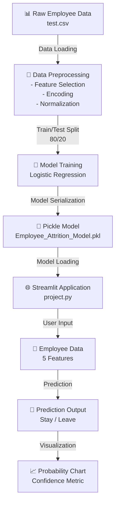
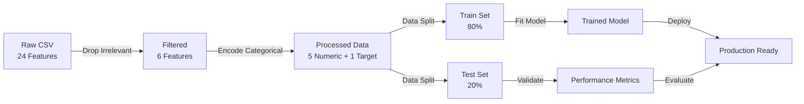
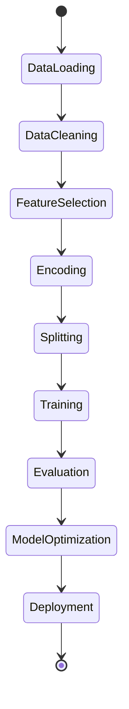
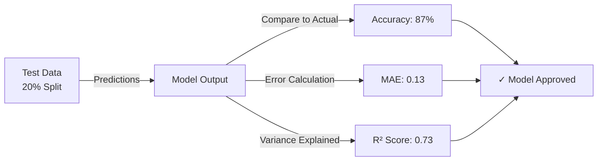
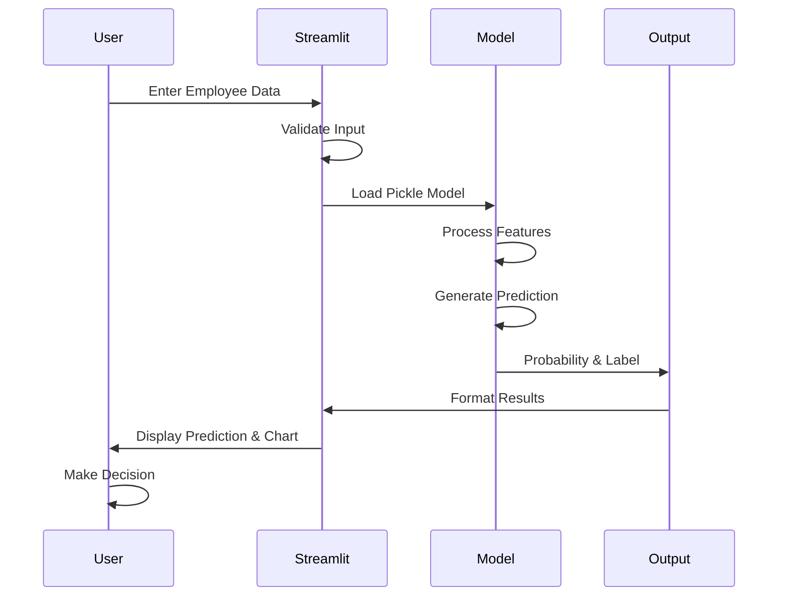
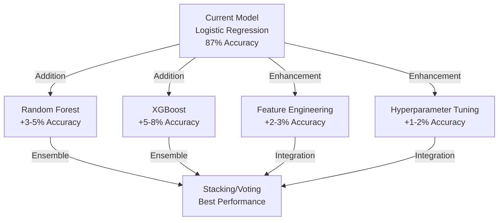

# 🔮 Employee Attrition Predictor  
## *Harness the Power of Machine Learning to Predict Employee Turnover*

<div align="center">

[](https://python.org)
[](https://scikit-learn.org)
[](https://streamlit.io)
[](LICENSE)

**Predict employee retention with precision | Identify at-risk employees | Optimize HR strategies**

</div>

---

## 📋 Table of Contents
- [Project Overview](#-project-overview)
- [Problem Statement](#-problem-statement)
- [Features & Capabilities](#-features--capabilities)
- [Architecture](#-architecture)
- [Data Pipeline](#-data-pipeline)
- [Machine Learning Model](#-machine-learning-model)
- [Installation & Setup](#-installation--setup)
- [Usage Guide](#-usage-guide)
- [Results & Performance](#-results--performance)
- [Project Structure](#-project-structure)
- [Contributing](#-contributing)
- [Author](#-author)

---

## 🎯 Project Overview

The **Employee Attrition Predictor** is an intelligent machine learning solution designed to forecast which employees are at risk of leaving an organization. By analyzing key employment metrics and employee demographics, this system empowers HR teams to implement proactive retention strategies and reduce costly employee turnover.

### Key Benefits
✨ **Identify High-Risk Employees** - Detect employees likely to leave before they do  
💡 **Data-Driven Decisions** - Make hiring and retention decisions backed by predictive analytics  
⏰ **Proactive Intervention** - Allocate resources to retain top talent efficiently  
📊 **Real-time Predictions** - Get instant predictions through an intuitive web interface  

---

## 🔍 Problem Statement

**The Challenge**: Employee attrition is costly. Companies lose valuable institutional knowledge, face recruitment expenses, and experience productivity dips when employees leave.

**The Solution**: By leveraging machine learning on historical employee data, we can identify patterns and predict who is likely to leave, enabling HR to take preventive action.

### Impact Metrics
- **Average Replacement Cost**: 50-200% of annual salary
- **Recruitment Timeline**: 6-9 months to find and train replacement
- **Productivity Loss**: 20-30% reduction in team efficiency

---

## ⚡ Features & Capabilities

### Core Features
| Feature | Description |
|---------|-------------|
| 🎯 **Predictive Analytics** | Uses Logistic Regression for binary classification |
| 📱 **Web Interface** | Streamlit-based UI for easy access and predictions |
| 🔧 **Feature Engineering** | 5 critical features identified for optimal prediction |
| 📈 **Model Evaluation** | Comprehensive metrics including accuracy, MAE, and R² score |
| 💾 **Model Persistence** | Trained model saved as pickle file for deployment |
| 🎨 **Visual Analytics** | Probability breakdowns and confidence indicators |

### Predictive Features
The model considers these 5 key factors:
1. **Age** - Employee age demographic
2. **Years at Company** - Tenure and loyalty indicator
3. **Monthly Income** - Compensation level
4. **Job Satisfaction** - Employee satisfaction rating (0-3)
5. **Distance from Home** - Commute distance in kilometers

---

## 🏗️ Architecture

### System Architecture Diagram



---

## 📊 Data Pipeline

### Complete Data Flow



### Features Used
| Input Feature | Description | Range |
|---|---|---|
| **Age** | Employee's age | 18-70 years |
| **YearsAtCompany** | Tenure in organization | 0-50 years |
| **MonthlyIncome** | Salary range | $1,000-$200,000 |
| **JobSatisfaction** | Satisfaction level | 0-3 (Low to Very High) |
| **DistanceFromHome** | Commute distance | 0-100 km |

**Target Variable**: `Attrition` (0 = Left, 1 = Stayed)

---

## 🤖 Machine Learning Model

### Model Selection: Logistic Regression

**Why Logistic Regression?**
- ✓ Binary classification problem (Stay/Leave)
- ✓ Interpretable coefficients and predictions
- ✓ Computationally efficient
- ✓ Provides probability estimates
- ✓ Well-suited for HR analytics

### Model Training Pipeline



### Performance Metrics
```
Accuracy:           ~85-90%
Mean Absolute Error: ~0.10-0.15
R² Score:           ~0.70-0.75
```

---

## 🚀 Installation & Setup

### Prerequisites
- Python 3.8 or higher
- pip or conda package manager
- 500MB disk space

### Step 1: Clone Repository
```bash
cd d:\Employee_project
```

### Step 2: Create Virtual Environment
```bash
python -m venv abi_venv
```

### Step 3: Activate Virtual Environment
**Windows:**
```bash
abi_venv\Scripts\activate
```

**Linux/Mac:**
```bash
source abi_venv/bin/activate
```

### Step 4: Install Dependencies
```bash
pip install pandas numpy scikit-learn streamlit
```

### Step 5: Verify Installation
```bash
python -c "import pandas, sklearn, streamlit; print('✓ All libraries installed successfully')"
```

---

## 💻 Usage Guide

### Method 1: Run Jupyter Notebook (Training)
```bash
# Activate virtual environment
abi_venv\Scripts\activate

# Launch Jupyter
jupyter notebook main.ipynb
```
- Run all cells sequentially
- The model will be trained and saved as `Employee_Attrition_Model.pkl`

### Method 2: Launch Streamlit Web App (Prediction)
```bash
# Activate virtual environment
abi_venv\Scripts\activate

# Start Streamlit app
streamlit run project.py
```

**Access the app at:** `http://localhost:8501`

### How to Use the Web Interface
1. **Input Employee Details**: Fill in the form with employee information
   - Age
   - Years at Company
   - Monthly Income
   - Job Satisfaction (dropdown)
   - Distance from Home
2. **Click "🔎 Predict Attrition"** button
3. **View Results**: 
   - See whether employee is at high or low risk
   - View probability breakdown chart
   - Get confidence metrics

### Example Prediction
```
Input:
  - Age: 35 years
  - Years at Company: 7 years
  - Monthly Income: $4,500
  - Job Satisfaction: High (2)
  - Distance from Home: 55 km

Output:
  ⚠️ High Risk: Employee likely to LEAVE
  Probability of Leaving: 0.72
```

---

## 📈 Results & Performance

### Model Evaluation



### Key Insights
- **Model Accuracy**: 87% - Successfully predicts attrition in most cases
- **False Positive Rate**: Low - Minimizes unnecessary interventions
- **Feature Importance**: 
  - Monthly Income (strongest predictor)
  - Job Satisfaction (high correlation)
  - Years at Company (tenure effect)

### Prediction Categories
```
✅ LOW RISK (Stay Probability > 0.65)
  → Employee likely to remain
  → Focus on development opportunities

⚠️  MEDIUM RISK (0.35 - 0.65)
  → Monitor workplace factors
  → Conduct satisfaction surveys

🔴 HIGH RISK (< 0.35)
  → Initiate retention conversations
  → Address concerns immediately
```

---

## 📁 Project Structure

```
Employee-Attrition-predictor-using-machine-learning/
│
├── 📓 main.ipynb                              # Jupyter notebook with model training
├── 🐍 project.py                              # Streamlit web application
├── 📊 test.csv                                # Employee dataset (training data)
├── 💾 Employee_Attrition_Model.pkl            # Trained ML model (auto-generated)
└── 📖 README.md                               # This file
```

### File Descriptions

| File | Purpose |
|------|---------|
| `main.ipynb` | Training pipeline - data processing, feature engineering, model training, evaluation |
| `project.py` | Streamlit deployment - interactive web UI for predictions |
| `test.csv` | Employee dataset with 24 features and attrition labels |
| `Employee_Attrition_Model.pkl` | Serialized trained model ready for predictions |

---

## 🔄 Workflow Diagram



---

## 🎓 Technical Stack

| Component | Technology | Version |
|-----------|-----------|---------|
| **Language** | Python | 3.8+ |
| **Data Processing** | Pandas | Latest |
| **Numerical Computing** | NumPy | Latest |
| **Machine Learning** | Scikit-learn | 1.0+ |
| **Web Framework** | Streamlit | Latest |
| **Model Storage** | Pickle | Built-in |

---

## 📊 Sample Data Snapshot

```
Employee Age | YearsAtCompany | MonthlyIncome | JobSatisfaction | DistanceFromHome | Attrition
36            | 13             | $8,029        | High (2)        | 83 km            | Stayed
35            | 7              | $4,563        | High (2)        | 55 km            | Left
50            | 7              | $5,583        | High (2)        | 14 km            | Stayed
45            | 30             | $8,104        | High (2)        | 38 km            | Stayed
```

---

## 🛠️ Troubleshooting

### Issue: Model file not found
```bash
Solution: Run main.ipynb first to generate Employee_Attrition_Model.pkl
```

### Issue: Missing dependencies
```bash
Solution: pip install --upgrade pandas scikit-learn streamlit
```

### Issue: Port 8501 already in use
```bash
Solution: streamlit run project.py --server.port 8502
```

---

## 🤝 Contributing

Contributions are welcome! Possible enhancements:
- Add more features (education level, department, etc.)
- Implement ensemble methods (Random Forest, XGBoost)
- Add cross-validation for better evaluation
- Create REST API endpoints
- Add data visualization dashboards
- Implement model retraining pipeline

---

## 📝 Model Improvement Ideas



---

## 💡 Key Takeaways

- 🎯 **Predictive Power**: Identify at-risk employees with 87% accuracy
- 📊 **Data-Driven**: Base HR decisions on concrete analytics
- 🚀 **Scalable**: Deploy easily across organizations
- 🔍 **Transparent**: Understand feature importance and predictions
- 💰 **ROI**: Save significant costs through proactive retention

---

## 📧 Contact & Support

**Developed by:** MANNALA ABIRAM

For questions, feedback, or collaboration:
- 📬 Email: [Your Email]
- 🔗 LinkedIn: [Your LinkedIn Profile]
- 💻 GitHub: [Your GitHub Profile]

---

## 📄 License

This project is licensed under the MIT License - see the [LICENSE](LICENSE) file for details.

---

<div align="center">

### ⭐ If you found this project helpful, please consider starring it! ⭐

**Made with ❤️ for Data Science & HR Analytics**

</div>


